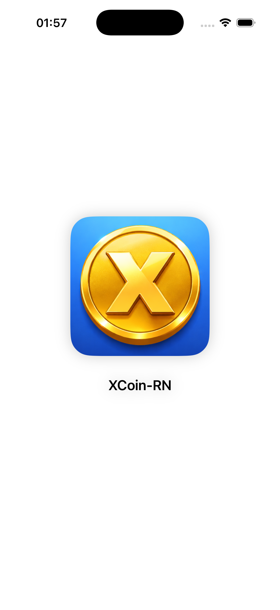
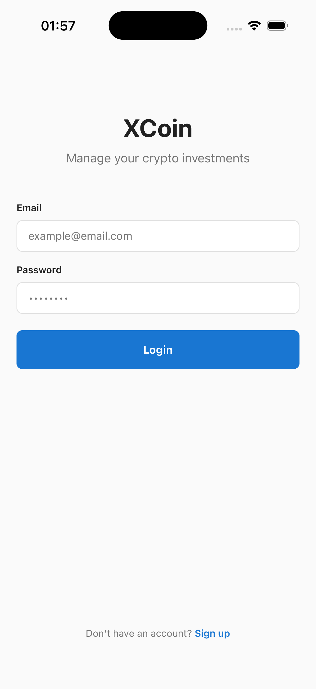
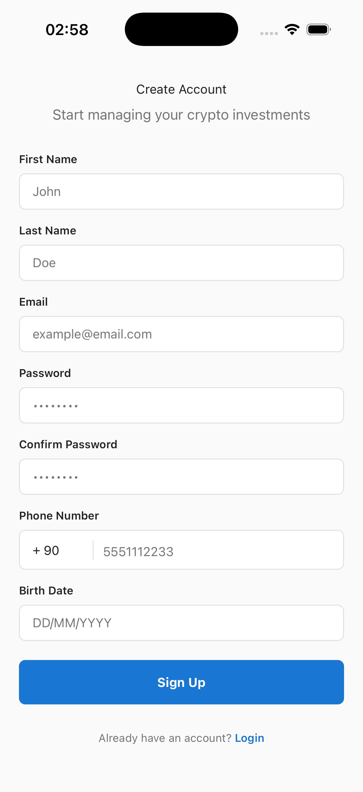
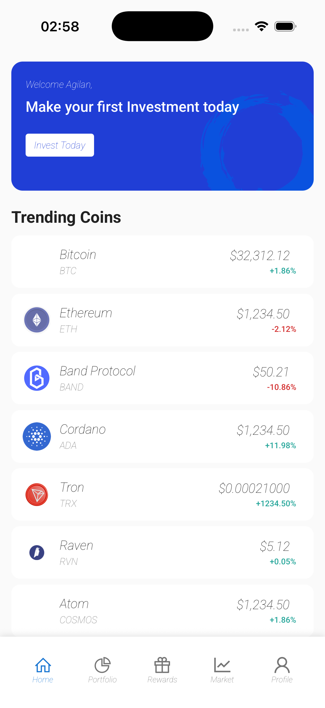
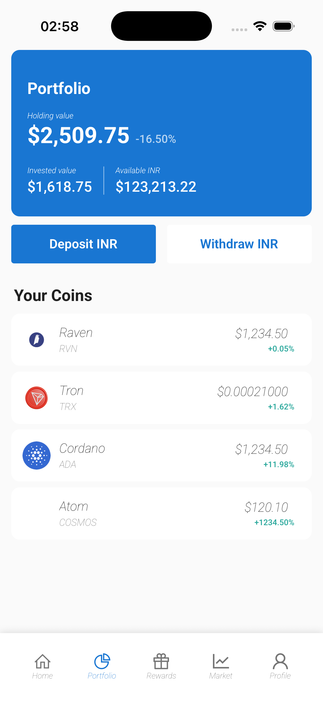
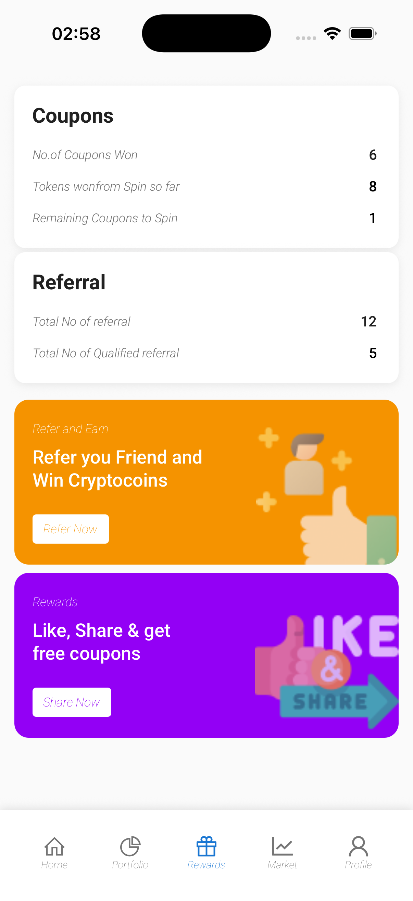
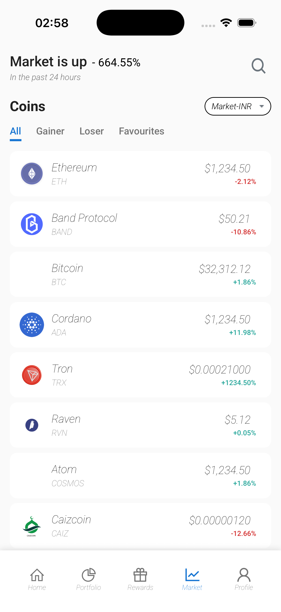
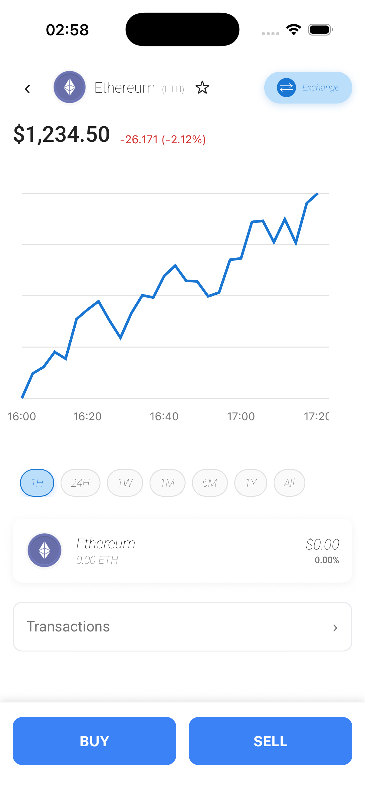
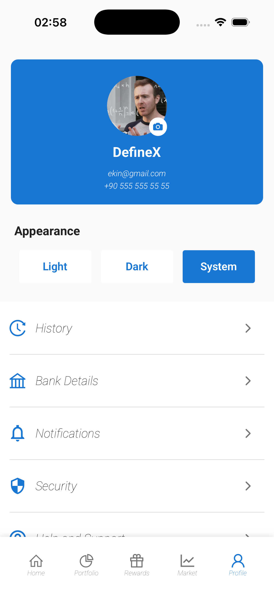
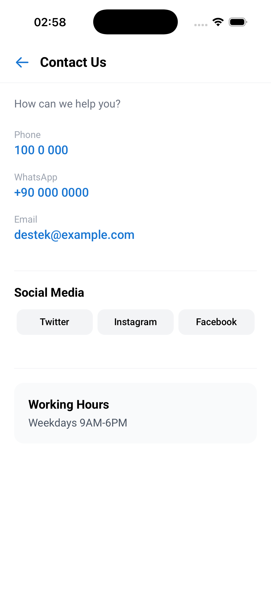

# XCoin RN

XCoin RN, Expo ve React Native ile geliştirilmiş, kripto para odaklı bir mobil uygulamadır. Uygulama; splash, giriş, kayıt ol, ana sayfa, market, portföy, ödüller, profil, iletişim ve coin detay akışlarını içerir. Tema, asset, versiyon, bakım ve iletişim verileri config API üzerinden yönetilir.

## Öne Çıkan Özellikler

- Expo tabanlı React Native mimarisi
- Expo Router ile dosya tabanlı yönlendirme
- Light, Dark ve System tema desteği
- Market, portföy, ödüller ve profil akışları
- Coin detay ekranı ve fiyat grafiği
- Firebase Analytics, Messaging ve Crashlytics entegrasyonu
- Push notification ve deep link desteği
- Config API üzerinden dinamik tema ve asset yönetimi
- freeRASP ile temel runtime güvenlik kontrolleri
- Türkçe ve İngilizce dil desteği

## Ekran Görselleri

<table>
  <tr>
    <td align="center">
      <strong>Splash</strong><br /><br />
      
    </td>
    <td align="center">
      <strong>Giriş</strong><br /><br />
      
    </td>
    <td align="center">
      <strong>Kayıt Ol</strong><br /><br />
      
    </td>
  </tr>
  <tr>
    <td align="center">
      <strong>Ana Sayfa</strong><br /><br />
      
    </td>
    <td align="center">
      <strong>Portföy</strong><br /><br />
      
    </td>
    <td align="center">
      <strong>Ödüller</strong><br /><br />
      
    </td>
  </tr>
  <tr>
    <td align="center">
      <strong>Market</strong><br /><br />
      
    </td>
    <td align="center">
      <strong>Coin Detay</strong><br /><br />
      
    </td>
    <td align="center">
      <strong>Profil</strong><br /><br />
      
    </td>
    <td align="center">
      <strong>İletişim</strong><br /><br />
      
    </td>
  </tr>
</table>

## Teknoloji Yığını

- Expo 54
- React Native 0.81
- React 19
- Expo Router
- TypeScript
- NativeWind
- Firebase Analytics
- Firebase Messaging
- Firebase Crashlytics
- Notifee
- i18next
- react-native-chart-kit

## Proje Yapısı

```text
app/
  _layout.tsx
  index.tsx
  (tabs)/
    _layout.tsx
    index.tsx
    market.tsx
    portfolio.tsx
    rewards.tsx
    profile.tsx
  screens/
    login.tsx
    sign-up.tsx
    contact.tsx
    coin-detail.tsx

src/
  api/
  components/
  constants/
  context/
  hooks/
  services/
  types/
  utils/

assets/
docs/
ios/
android/
```

## Kurulum

### Gereksinimler

- Node.js
- npm
- Xcode
- CocoaPods
- Android Studio

### Bağımlılıkları kur

```bash
npm install
```

### Geliştirme sunucusunu başlat

```bash
npm run start
```

### iOS

```bash
npx pod-install
npm run ios
```

### Android

```bash
npm run android
```

## Scriptler

```bash
npm run start
npm run ios
npm run android
npm run ios:release
npm run android:release
npm run bundle:analyze
npm run firebase-debug:android
npm run firebase-debug:android:off
```

## Konfigürasyon

Uygulama aşağıdaki alanlarda config API kullanır:

- Theme config
- Asset config
- Version config
- Maintenance config
- Contact config

İlgili endpoint tanımları `src/api/endpoints.ts` dosyasında yer alır.

## Notlar

- Tema renkleri runtime sırasında config servisinden gelir.
- Bazı native modüller Expo Go yerine development build gerektirir.
- Firebase yapılandırma dosyaları proje içinde yer alır:
  - `google-services.json`
  - `GoogleService-Info.plist`
- Release scriptleri obfuscation desteğiyle tanımlanmıştır.

## Dil Desteği

- Türkçe
- İngilizce


<div align="center">
  <sub>Crafted with Expo, React Native and by</sub>
  <br />
  <strong>DefineX Mobile Team</strong>
  <br /><br />

  
  
  
</div>
